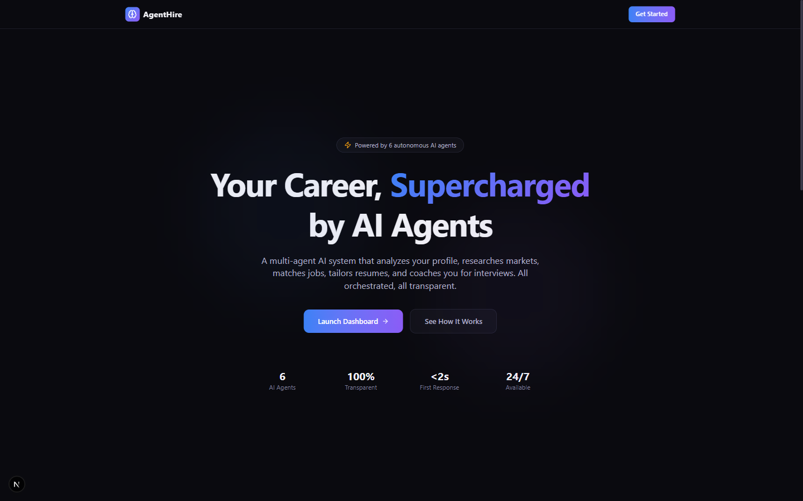
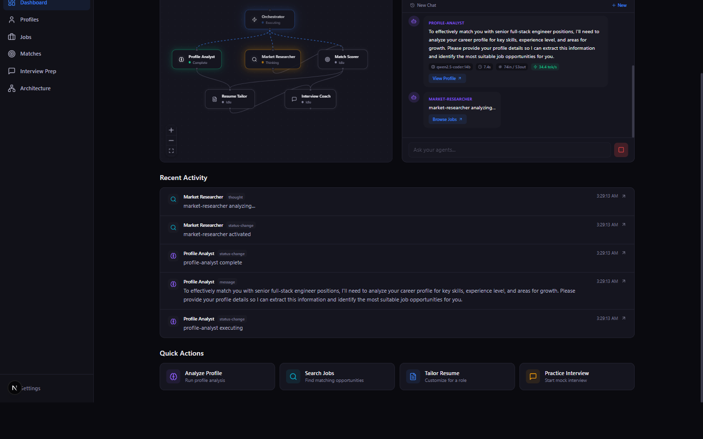
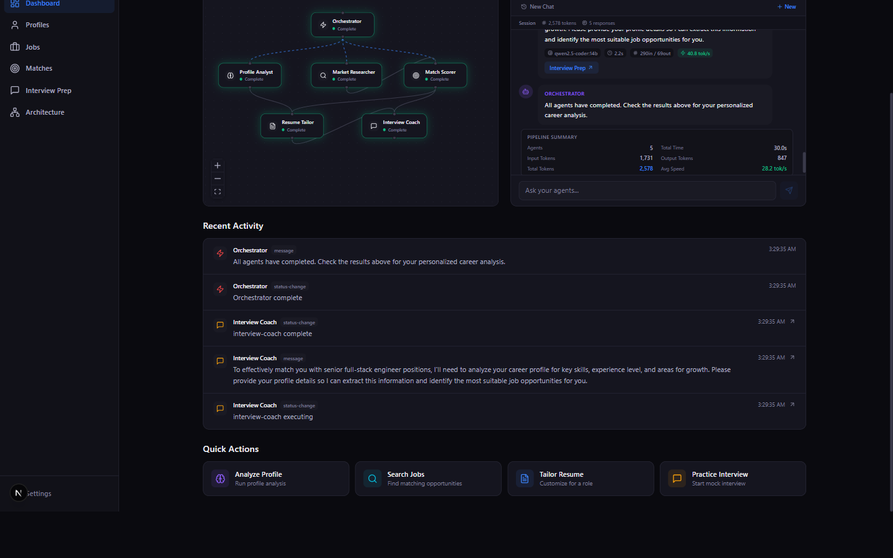
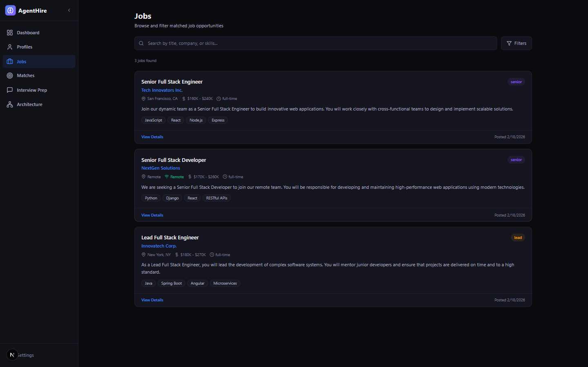
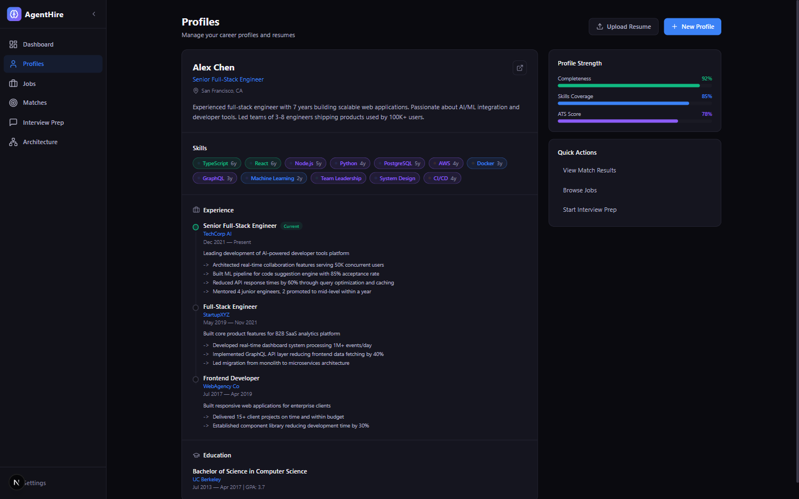
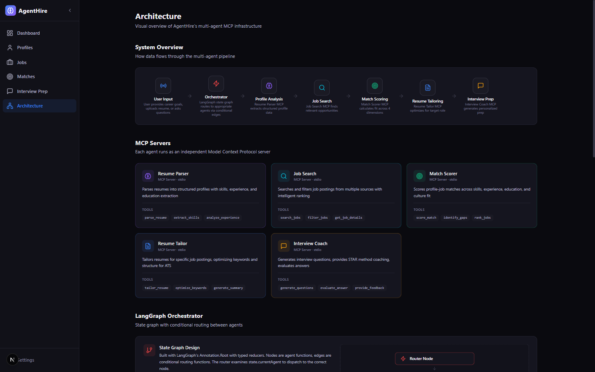
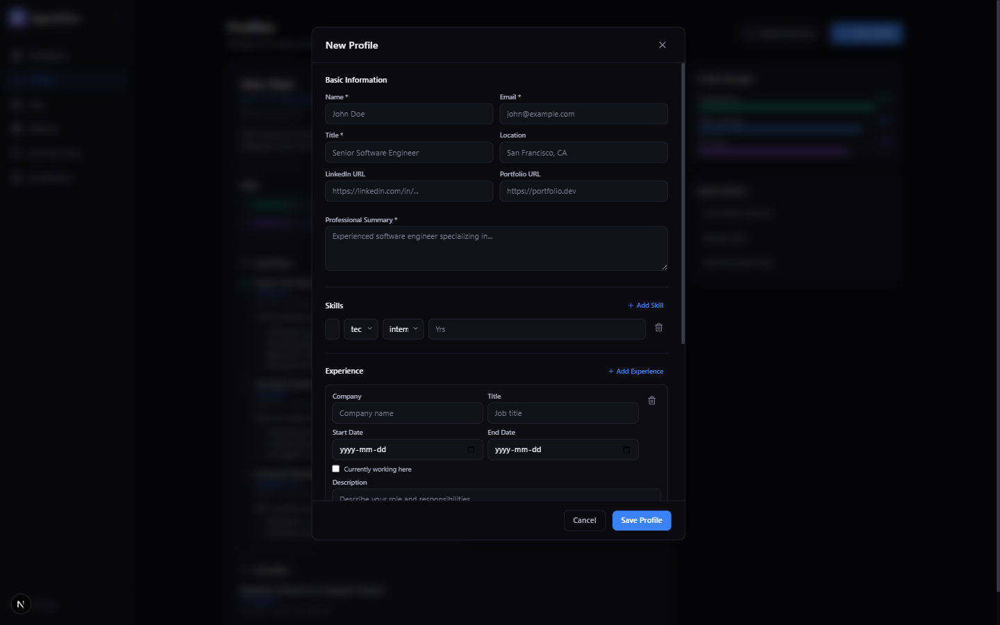
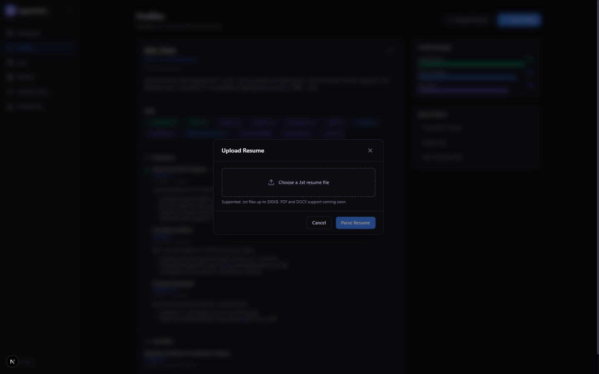

# AgentHire

**Multi-agent AI platform that automates the entire job search lifecycle — powered entirely by local LLM inference with Ollama. Zero cloud API costs. Full data privacy.**

Five specialized AI agents — coordinated by an orchestrator — analyze profiles, search jobs, score matches, tailor resumes, and coach interviews. Each agent runs as an independent MCP server. Real-time streaming via SSE. Persistent chat sessions with live data flowing into every page.

**11 packages | Turborepo monorepo | TypeScript strict mode**

[](https://aptsalt.github.io/agenthire)
[](https://ollama.ai)
[](https://nextjs.org)
[](https://typescriptlang.org)

### [Live Demo](https://aptsalt.github.io/agenthire/)

---

## Screenshots

<table>
<tr>
<td width="33%"><b>Landing Page</b><br><a href="docs/screenshots/landing.png"></a></td>
<td width="33%"><b>Dashboard — Agents Thinking</b><br><a href="docs/screenshots/dashboard-agents-active.png"></a></td>
<td width="33%"><b>Dashboard — Pipeline Complete</b><br><a href="docs/screenshots/dashboard-complete.png"></a></td>
</tr>
<tr>
<td><i>Hero page with agent count and stats</i></td>
<td><i>Profile Analyst complete (34.4 tok/s), Market Researcher thinking — React Flow graph updates live</i></td>
<td><i>All 5 agents done: 2,578 tokens, 30.0s, 28.2 tok/s — zero cloud API calls</i></td>
</tr>
<tr>
<td width="33%"><b>Jobs — Live from Pipeline</b><br><a href="docs/screenshots/jobs.png"></a></td>
<td width="33%"><b>Profile Management</b><br><a href="docs/screenshots/profiles.png"></a></td>
<td width="33%"><b>Architecture Overview</b><br><a href="docs/screenshots/architecture.png"></a></td>
</tr>
<tr>
<td><i>3 jobs auto-populated from Market Researcher JSON — salary, skills, remote badges</i></td>
<td><i>Skills, experience timeline, education, profile strength metrics (92% completeness)</i></td>
<td><i>Pipeline flow, MCP servers with tools, LangGraph orchestrator details</i></td>
</tr>
<tr>
<td width="33%"><b>New Profile Form</b><br><a href="docs/screenshots/new-profile-modal.png"></a></td>
<td width="33%"><b>Upload Resume — AI Parsing</b><br><a href="docs/screenshots/upload-resume-modal.png"></a></td>
<td width="33%"></td>
</tr>
<tr>
<td><i>Dynamic skills (category/level), experience, education sections with validation</i></td>
<td><i>Upload .txt resume — Ollama parses into structured profile for review</i></td>
<td></td>
</tr>
</table>

---

## Why Ollama? 100% Local LLM Inference

> **This is the core design principle of AgentHire.** Every AI operation runs on your local machine via [Ollama](https://ollama.ai). No API keys required. No cloud costs. No data leaves your hardware.

### How It Works

```
Your Machine (GPU)
    |
    v
Ollama Server (localhost:11434)
    |
    v
qwen2.5-coder:14b model (14B parameters)
    |
    v
Next.js API Routes call Ollama directly
    |
    +---> /api/orchestrate    --> 5-agent pipeline (profile, jobs, matches, resume, interview)
    +---> /api/parse-resume   --> Resume text -> structured Profile JSON
    |
    v
Browser receives SSE stream --> real-time agent updates
```

### Performance on Local Hardware

| Metric | Value |
|--------|-------|
| **Model** | `qwen2.5-coder:14b` (14B parameters) |
| **GPU** | RTX 4090 (16GB VRAM) |
| **Throughput** | ~37-40 tokens/sec |
| **Full 5-agent pipeline** | ~20-25 seconds total |
| **Resume parsing** | ~5-10 seconds |
| **Temperature** | 0.3 (pipeline) / 0.1 (resume parsing) |
| **API key required** | None |

### What Ollama Handles

| Feature | Ollama Usage |
|---------|-------------|
| **Profile Analysis** | Free-text career profile assessment |
| **Job Search** | Structured JSON with job listings |
| **Match Scoring** | 4-dimension scoring (skills, experience, education, culture) |
| **Resume Tailoring** | ATS optimization suggestions |
| **Interview Coaching** | Topic-based questions with coaching tips |
| **Resume Parsing** | Raw text -> structured Profile JSON extraction |

Every agent's system prompt is carefully engineered to get the local model to return either structured JSON (for data-driven pages) or concise free-text (for analysis pages). The `extractJSON()` utility handles markdown fences and raw JSON extraction robustly.

### Switching Models

```env
# In .env or .env.local
OLLAMA_MODEL=qwen2.5-coder:14b    # Default (recommended for 16GB+ VRAM)
OLLAMA_MODEL=qwen2.5-coder:7b     # For 8GB VRAM GPUs
OLLAMA_MODEL=llama3.1:8b           # Alternative
OLLAMA_MODEL=mistral:7b            # Alternative
```

Any Ollama-compatible model works. Larger models produce better structured JSON output. The 14B model hits the sweet spot for structured output quality vs. speed.

### Cloud Fallback (Optional)

If you prefer cloud inference, set `ANTHROPIC_API_KEY` and the `@agenthire/shared` package's `callLLM()` will route to Claude. Prompt caching is enabled to reduce cost on repeated system prompts. But Ollama is the default — and the recommended — path.

### Demo Mode (No GPU Required)

If Ollama isn't running, the app automatically falls back to **demo simulation mode** — a client-side async generator that produces the same event types with realistic delays and pre-built structured data. Every page still works, populated from demo data. This is what powers the GitHub Pages static deployment.

---

## Live Data Pipeline

Three agents return structured JSON alongside their chat responses, which auto-populate dashboard pages:

```
User Input
    |
    v
Orchestrator
    |
    +---> Profile Analyst    ---> free-text profile analysis
    +---> Market Researcher  ---> JSON: jobs[]           --> Jobs page
    +---> Match Scorer       ---> JSON: matches[]        --> Matches page
    +---> Resume Tailor      ---> free-text resume advice
    +---> Interview Coach    ---> JSON: topics[]          --> Interview Prep page
    |
    v
SSE Stream ---> Browser (real-time updates + structured data dispatch)
    |
    v
localStorage (Zustand persist) ---> All pages read reactively from store
```

| Agent | Structured Output | Target Page |
|-------|------------------|-------------|
| Market Researcher | `{ summary, jobs: [{ title, company, location, remote, salaryMin, salaryMax, skills, requirements }] }` | Jobs |
| Match Scorer | `{ summary, matches: [{ jobTitle, overallScore, skillMatchScore, experienceMatchScore, educationMatchScore, cultureFitScore, skillGaps, strengths }] }` | Matches |
| Interview Coach | `{ summary, topics: [{ title, category, difficulty, questions: [{ question, tip }] }] }` | Interview Prep |

---

## Features

### Dashboard Pages

| Page | Description |
|------|-------------|
| **Dashboard** | Agent status cards, React Flow orchestration graph, persistent chat with session picker, activity feed |
| **Profiles** | Profile card with skills/experience/education, upload resume (AI-parsed), manual profile creation |
| **Jobs** | Live job cards from pipeline — salary, location, remote badge, skills tags, expandable requirements |
| **Matches** | Live match scores — score ring visualization, 4-dimension breakdown, skill gaps analysis |
| **Interview Prep** | Topics by category/difficulty, practice questions with coaching tips, target role banner |
| **Architecture** | Visual system overview — pipeline flow, MCP servers, LangGraph details, tech stack |

### Profile Features (New)

- **Upload Resume**: Select a `.txt` file -> Ollama parses it into structured profile data -> review in form -> save
- **New Profile**: Manual form with dynamic skills (category/level), experience (highlights), education sections
- **AI Resume Parsing**: The `/api/parse-resume` route sends resume text to Ollama with a structured extraction prompt
- **Profile Persistence**: Saved to localStorage via Zustand persist — survives page refresh and navigation

### Chat Features

- **Session persistence** — messages survive navigation and page refresh
- **Session picker** — switch between up to 10 chat sessions
- **Inference telemetry** — per-message stats: model, duration, token counts, tok/s
- **Pipeline summary** — total tokens, total time, agent count on completion
- **Structured data dispatch** — agent JSON responses auto-populate Jobs, Matches, and Interview Prep pages
- **Demo mode fallback** — works without Ollama using simulated agent responses

---

## Getting Started

### Prerequisites

- Node.js >= 20
- npm >= 10
- [Ollama](https://ollama.ai) installed with a model pulled

### Setup

```bash
# Clone
git clone https://github.com/aptsalt/agenthire.git
cd agenthire

# Install dependencies
npm install

# Pull the LLM model
ollama pull qwen2.5-coder:14b

# Start Ollama (if not already running)
ollama serve

# Start dev server
npm run dev
```

Open `http://localhost:3002` — the dashboard loads with all agents standing by.

### Environment Variables

Create `.env.local` in `apps/web/`:

```env
# Ollama (default — no key needed)
OLLAMA_BASE_URL=http://localhost:11434
OLLAMA_MODEL=qwen2.5-coder:14b

# Anthropic (optional, for cloud inference)
ANTHROPIC_API_KEY=sk-ant-...

# Supabase (optional, for database persistence)
NEXT_PUBLIC_SUPABASE_URL=https://your-project.supabase.co
NEXT_PUBLIC_SUPABASE_ANON_KEY=your-anon-key
```

### Verify Everything Works

1. Open http://localhost:3002, navigate to **Dashboard**
2. Send a message in chat: *"Analyze my profile and find matching jobs"*
3. Watch agents stream responses with real-time inference stats
4. Navigate to **Jobs** — live job cards appear from pipeline
5. Navigate to **Matches** — live match scores with 4-dimension breakdown
6. Navigate to **Interview Prep** — topics and questions from pipeline
7. Navigate to **Profiles** — click "Upload Resume" or "New Profile"
8. Refresh the page — all data persists via localStorage
9. If Ollama is off, demo mode kicks in automatically

---

## Tech Stack

| Layer | Technology |
|-------|-----------|
| **Frontend** | Next.js 15, React 19, Tailwind CSS 4, Zustand 5 (persist), React Flow 12 |
| **Agent Protocol** | Model Context Protocol (MCP) SDK, stdio transport |
| **Orchestration** | LangGraph, conditional state graph routing |
| **LLM Inference** | **Ollama** (qwen2.5-coder:14b local), Anthropic Claude (optional) |
| **Database** | Supabase, PostgreSQL, pgvector |
| **Observability** | OpenTelemetry, pino |
| **Validation** | Zod (runtime schemas + TypeScript types) |
| **Build** | Turborepo, TypeScript 5.7 (strict mode), ESM |
| **Testing** | Vitest (unit), Playwright (E2E), custom eval framework |
| **Streaming** | Server-Sent Events (SSE) via ReadableStream |
| **Persistence** | localStorage via Zustand persist middleware |

---

## Monorepo Structure

```
agenthire/
  apps/
    web/                              # Next.js 15 frontend (App Router, Turbopack)
      app/
        layout.tsx                    # Root layout (Inter font, dark theme)
        page.tsx                      # Landing page
        globals.css                   # Design tokens, animations, React Flow styles
        (dashboard)/
          layout.tsx                  # Sidebar navigation, collapsible
          dashboard/
            page.tsx                  # Dashboard: agent status, graph, chat, activity
            profiles/page.tsx         # Profile card, upload resume, new profile
            jobs/page.tsx             # Live job cards from pipeline
            matches/page.tsx          # Live match scores from pipeline
            interview-prep/page.tsx   # Live topics & questions from pipeline
            architecture/page.tsx     # System architecture visualization
        api/
          orchestrate/route.ts        # SSE streaming 5-agent pipeline
          parse-resume/route.ts       # Resume text -> Profile JSON via Ollama
      components/
        agent-flow/agent-graph.tsx    # React Flow orchestration graph
        chat/chat-panel.tsx           # Persistent chat with session picker
        profile/
          profile-card.tsx            # Profile display component
          profile-form-modal.tsx      # Manual profile creation form
          resume-upload-modal.tsx     # Resume upload + AI parsing flow
      lib/
        store.ts                      # Zustand store with persist middleware
        demo-simulation.ts            # Demo fallback with structured data
        supabase.ts                   # Supabase client
  packages/
    shared/                           # Zod schemas, types, LLM client, BaseMcpAgent
    observability/                    # OpenTelemetry tracing, metrics, pino logging
    orchestrator/                     # LangGraph state graph, routing, SSE streaming
    evals/                            # Eval runner, scorers, fixtures, CLI reporter
    mcp-servers/
      resume-parser/                  # MCP: parse resumes into structured profiles
      job-search/                     # MCP: search and filter job postings
      match-scorer/                   # MCP: score profile-job matches
      resume-tailor/                  # MCP: tailor resumes for specific jobs
      interview-coach/                # MCP: interview questions & coaching
      project-tools/                  # MCP: project management utilities
  supabase/
    migrations/                       # SQL: schema, indexes, RLS policies, triggers
  docs/
    ARCHITECTURE.md                   # Detailed system architecture
    API.md                            # API endpoint documentation
    FRONTEND.md                       # Frontend architecture and data flow
    screenshots/                      # App screenshots for README
```

---

## MCP Servers

Each agent is a standalone MCP server communicating over stdio transport:

| Server | Package | Tools |
|--------|---------|-------|
| Resume Parser | `@agenthire/mcp-resume-parser` | `parse_resume`, `extract_skills`, `analyze_experience` |
| Job Search | `@agenthire/mcp-job-search` | `search_jobs`, `filter_jobs`, `get_job_details` |
| Match Scorer | `@agenthire/mcp-match-scorer` | `score_match`, `identify_gaps`, `rank_jobs` |
| Resume Tailor | `@agenthire/mcp-resume-tailor` | `tailor_resume`, `optimize_keywords`, `generate_summary` |
| Interview Coach | `@agenthire/mcp-interview-coach` | `generate_questions`, `evaluate_answer`, `provide_feedback` |

Built on `@modelcontextprotocol/sdk` with Zod input validation and a shared `BaseMcpAgent` abstract class.

---

## Architecture Decisions

| Decision | Rationale |
|----------|-----------|
| **Ollama over cloud-only** | Zero-cost inference, full data privacy, no rate limits, works offline |
| **MCP over direct function calls** | Agent isolation, independent scaling, protocol standardization |
| **LangGraph over custom routing** | Type-safe state management, conditional edges, human-in-the-loop support |
| **SSE over WebSockets** | Simpler server implementation, automatic reconnection, unidirectional is sufficient |
| **Zustand over Redux** | Minimal boilerplate, persist middleware for localStorage, direct store access |
| **JSON agent prompts** | Structured output auto-populates pages — not just chat text |
| **Turborepo monorepo** | Shared types, dependency-aware builds, incremental caching |

---

## Commands

```bash
npm run dev            # Start all packages in dev mode
npm run build          # Build all packages (respects dependency order)
npm run test           # Run vitest across all packages
npm run type-check     # TypeScript strict mode check
npm run lint           # Lint all packages
npm run eval           # Run eval suites
npm run eval:report    # Display eval results
```

---

## Documentation

| Document | Description |
|----------|-------------|
| [Architecture](docs/ARCHITECTURE.md) | System architecture, data flow diagrams, package responsibilities |
| [API](docs/API.md) | REST/SSE endpoint documentation, event schemas, agent JSON formats |
| [Frontend](docs/FRONTEND.md) | Store shape, component inventory, page data flow, design tokens |

---

## License

MIT
